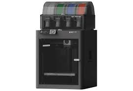
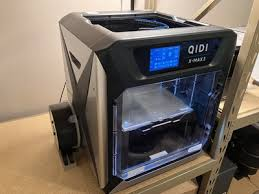

# Police Your Brass Bot - 3d Model Info

# Printers
|<a href="https://bambulab.com/en/p1" target="_blank">P1S</a>|<a href="https://qidi3d.com/products/qidi-x-max-3" target="_blank">XMAX3</a>|
|:---:|:---:|
||| 

# Model Settings
### PLA+ Files
<table>
<tr><th>RoombaCover.stl </th><th>Frame.stl</th><th>WheelHub.stl</th></tr>
<tr><td>

|Setting| Value |
|--|--|
|Material | PLA+ |
|Layer Hgt | 0.2 |
|Infill | 100% |
|Support | None |
|Walls | 4|

</td><td>

|Setting| Value |
|--|--|
|Material | PLA+ |
|Layer Hgt | 0.2 |
|Infill | 100% |
|Support | None |
|Walls | 4|
</td><td>

|Setting| Value |
|--|--|
|Material | PLA+ |
|Layer Hgt | 0.2 |
|Infill | 100% |
|Support | None |
|Walls | 4|

</td></tr> </table>

### TPU Files
<table>
<tr><th>WheelTine.stl </th><th>WheelTineSpacer.stl</th></tr>
<tr><td>

|Setting| Value |
|--|--|
|Material | TPU |
|Layer Hgt | 0.2 |
|Infill | 25% |
|Support | Build Plate |
|Walls | 4|
|Cleanup| Remove support|

</td><td>

|Setting| Value |
|--|--|
|Material | TPU |
|Layer Hgt | 0.2 |
|Infill | 100% |
|Support | None |
|Walls | 4|
|Cleanup | Remove mouse ears|

</td></tr> </table>