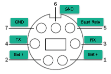
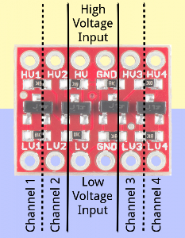

# Police Your Brass Bot
A robotics project for <a href="https://courses.dce.harvard.edu/?details&srcdb=202403&crn=34560" target="_blank">DGMD E-17 Spring 2024</a> that collects spent shell casings (brass).

Collecting brass at the firing range is a tedious task that no one seems to enjoy.
There are <a href="https://ammoupusa.com/" target="_blank">manual</a> options that exist to complete the job, but with modern advances in technology an automated solution is in order.

We are taking 2 approaches to prototyping that solution. 
1. Create an RC Car like robot operated via Raspberry PI along with a <a href="https://pixhawk.org/" target="_blank">PixHawk</a> for navigation.
2. Roomba controlled via a Raspberry PI communicating via the serial port.

# Materials - Roomba Implementation
## Hardware
| Qnty | Description |
 | :--- | :--- |
 | 1 pc | Roomba 675 (or similar model with Serial Port)|
 | 1 pc | Raspberry PI 4B (Raspberry PI Zero 2 W will suffice if not adding LIDAR)|
 | 1 pc | <a href="https://www.amazon.com/gp/product/B01N30ZCW9/ref=ppx_yo_dt_b_asin_title_o02_s01?ie=UTF8&psc=1" target="_blank">Logic Level Converter</a> 3.3v <--> 5v between Roomba and RPI|
 | 1 pc | <a href="https://www.amazon.com/Antrader-Breadboard-Dupont-Arduino-Raspberry/dp/B07H9W1NSL/ref=asc_df_B07S2RH6Q4/?tag=hyprod-20&linkCode=df0&hvadid=642064378071&hvpos=&hvnetw=g&hvrand=7589995796022015444&hvpone=&hvptwo=&hvqmt=&hvdev=c&hvdvcmdl=&hvlocint=&hvlocphy=9001937&hvtargid=pla-1950270815651&mcid=137eec5506e1362faf80206c621e4169&th=1" target="_blank">Jumper wires</a> to connect PI and other hardware|
 | 1 pk | <a href="https://www.adafruit.com/product/2438" target="_blank">Adafruit iRobot Mini-DIN Connector Cable</a> (or Female to Male wires - above)|
 | 1 pc | <a href="https://www.amazon.com/stores/page/CCB1B7D7-B735-4810-ADF3-647B8331BC8B?ingress=2&visitId=b8cc5521-5056-4274-9479-adf48f1fa2ec&ref_=ast_bln" target="_blank">Powerbank</a> 2 or more USB portss & 10,000 mAH or more recommended|
 |10 pcs| [5/8" 4-40](https://www.amazon.com/HELIFOUNER-Phillips-Assortment-Threaded-Stainless/dp/B0BNN7YRX8/ref=sr_1_1?c=ts&dib=eyJ2IjoiMSJ9.sI0YSuRbfV1zJAlFMzHS0F4tF73Gvkh_mOIZ8dn5wUTAOjcPCDz8CUKZpWqeyACBEftAkWiPymd5KvqJRBHNOclhbBs8qJh5V6PDeXANscrW727URSsyvvKe4uzfFurRq2ZBbsgrwXPpLCiR-Y9bCXZIOYufstVchsoSuwfdSn72hyDUHvg36XRHI9qyWLxTt5ma0z3fYt91y4J5gGneN0Wy0qP75oHElFRm_jZnjg-T1OimMPojVT7qwb3LNNYZb382iRUtiref0I4MpwhD9G60SvnzPnjZBbEX-r2sC5M.-OEKskB44uikWBCDGfm_1pXhZckGZ0sxHPxLtoDoRfM&dib_tag=se&keywords=Machine%2BScrews&qid=1714224760&refinements=p_n_feature_fourteen_browse-bin%3A11433955011&s=industrial&sr=1-1&ts_id=16403531&th=1) pan head screws (Philips worked best for me)|

## Mechanical / 3D Printed
 Most mechanical parts will be 3d printed (Deisgned by this team).<br>
 See the [3d folder](https://github.com/cwelect1/policeyourbrassbot/tree/main/3d).
 | Qnty | Description |
 | :--- | :--- |
 | 1 pc | Roomba Cover (exposes Serial Port) - modified design of <a href="https://www.thingiverse.com/thing:965107" target="_blank">this</a>. |
 |1 pc | Collector Frame - used to attach collector wheel to Roomba |
 |22 pcs | Collector Wheel Tines |
 |20 pcs | Collector Wheel Spacers |
 |1 pc | Collector Wheel Hub |
 |1 pc | Collector Teeth |
 |1 pc | Collector Bin |
 |2 pc | 1/4" diameter dowel 4" long|

## Tools / Misc.
 - Soldering Iron / Solder
 - Drill and bits (1/2", and 5/32")
 - Screw/Hex driver depending on fasteners chosen
 - RPI supplies (Monitor, keyboard, power supply, hdmi adapter/cables)

# Instructions
A few things:
 - Design is based on not opening Roomba or using it's power source
 - RPI and Roomba use different logic levels 0-3.3v and 0-5v respectively (hence the Logic Level Converter)
 - Our concentration is to pick up brass, then work on a proper mapping algorithm

## Hardware
### PI UART (Serial) to Roomba Mini-Din (Serial Port)
In order to communicate with the Roomba, we need to connect to:<br>
<table><tr><td>

- Transmit (TX pin 4)
- Recieve (RX pin 3) 
- Ground (pin 6 or 7)

</td><td>



</td></tr></table>

Roomba uses 5v logic levels and Raspberry PI 3.3v. To rememdy this difference and not fry the PI, we<br>
utilize the Sparkfun Logic Level Board. We only need 2 of the 4 channels.<br>



## Software
## Raspberry PI Setup
We are going to interact with the PI as a headless server and don't need the GUI. Ensure that:<br>
 - wifi is setup and working
 - SSH is enabled
 - know your username and pwd (obviously the defaults should be changed)

<a href="https://www.raspberrypi.com/documentation/computers/getting-started.html" target="_blank">Here's</a> a link to the offical RPI Getting Started docs.<br>

### Enable UART on RPI
***You need to REBOOT after this config update*** 
```
cd to /boot/config on the PI

# Comment out the console entry
# console=serial0,115200
#Enable UART if it isn't already enabled

enable_uart=1
```
### Install Required Libraries
1. ssh into the pi using your username@your_rpi's_ip_address
```
ssh pi@192.168.1.1
```
2. Confirm that you have Python 3.6 or higher installed. RPI comes installed with both 2.x and 3.x.
```
python3 -V
```
3. Install <a href="https://pypi.org/project/pyserial/" target="_blank">pyserial</a>. 
```
pip3 install pyserial
```
4. Install <a href="https://atsushisakai.github.io/PyRoombaAdapter/" target="_blank">pyrommbaadapter</a>. 
```
pip3 install pyroombaadapter
```
5. ...and finally...clone our <a href="https://github.com/cwelect1/policeyourbrassbot" target="_blank">repo</a>.
```
git clone git@github.com:cwelect1/policeyourbrassbot.git
```


# Issues / Challenges
 - Roomba to RPI serial communications seems to flake out. We've seen the same python code execute flawlessly once and then fail the very next execution.
 - Roomba wheel encoder(s) not reporting proper values. This has only happened on the Left wheel...and we replaced the whole wheel with same exact results (seems to be serial issue or problem on the main board)
 - Roomba doesn't go straight (ever) - perhaps this is related to bullet above
 - Adding LIDAR turned out to not be possible on RPI Zero. It only has one UART for Serial communication

# What's Next...
 - Work on code to monitor (and react to) sensors while roomba is moving. This has been more challenging then 1st thought
 - Improve 3d parts for fitment
 - Add LIDAR and implement SLAM algorithm for range mapping
 - Add object detection and avoidance

# References
 - Logic Level Board <a href="https://learn.sparkfun.com/tutorials/bi-directional-logic-level-converter-hookup-guide" target="_blank">Hookup Info/Diagram</a>
 - Roomba <a href="https://edu.irobot.com/learning-library/create-2-oi-spec" target="_blank">Open Interface</a> spec 